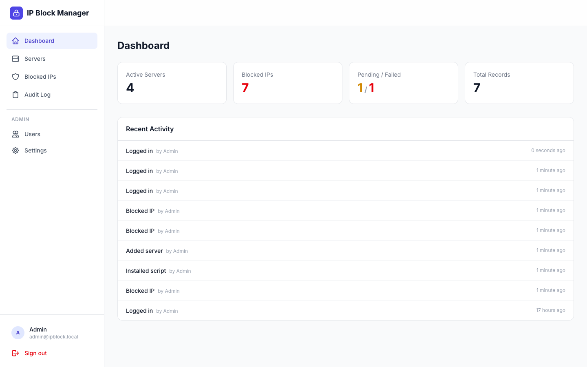
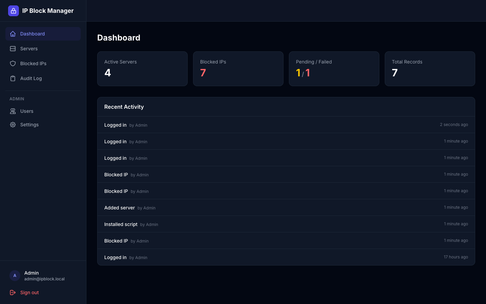
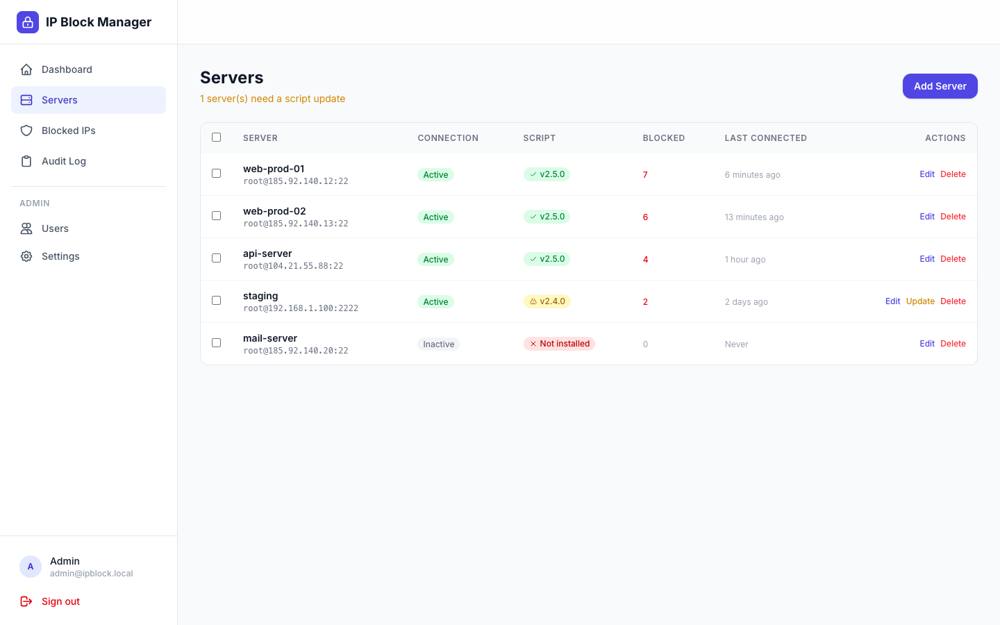
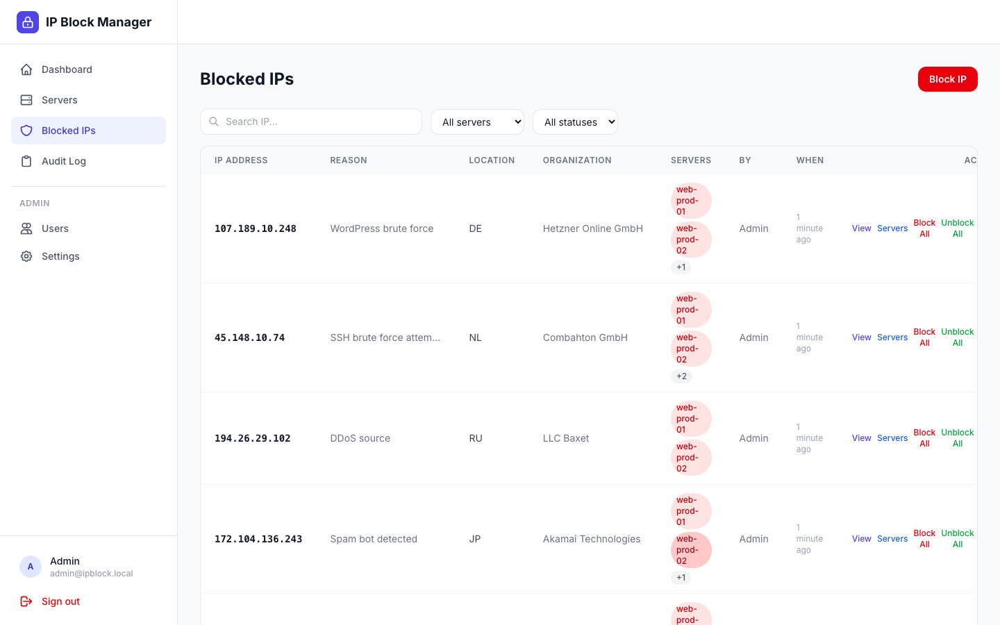
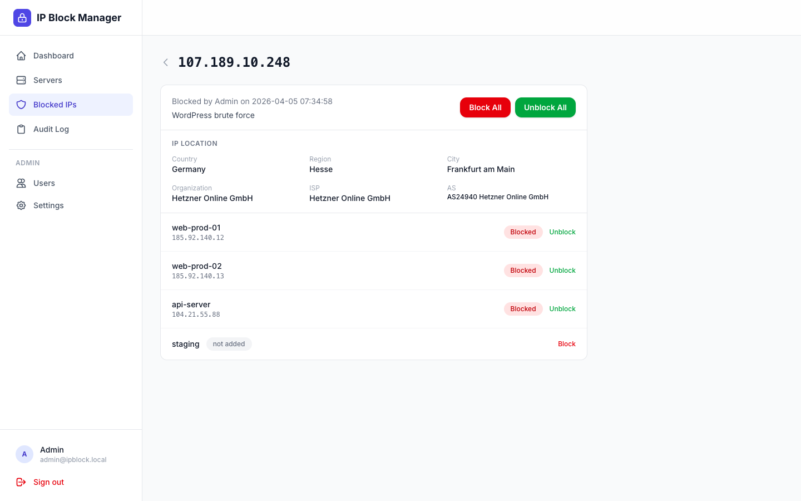

# IP Block Manager

[](LICENSE)
[](https://github.com/kayvanaarssen/ip-block-manager/releases)

A secure, mobile-first web dashboard for managing IP blocking across multiple servers via SSH. Built with Laravel 13, Vue 3, and Inertia.js.

Block and unblock IP addresses on all your servers with a single click. The app connects to each server over SSH, deploys the `blockip.sh` script automatically, and executes block/unblock commands across UFW, Fail2Ban, and NGINX simultaneously.

> **WARNING: Use at your own risk.** This software is provided "as is", without warranty of any kind, express or implied. The authors and contributors are **not responsible** for any changes made to, connections established with, or disruptions caused to your servers. You are solely responsible for managing access to your servers and the consequences of blocking or unblocking IP addresses. Always test in a staging environment before deploying to production. See [Disclaimer](#disclaimer) for full details.

---

## Screenshots

| Dashboard | Dark Mode |
|-----------|-----------|
|  |  |

| Servers | Blocked IPs |
|---------|-------------|
|  |  |

| IP Detail — Location, Per-Server Status & Actions |
|----------------------------------------------------|
|  |

---

## Features

### IP Blocking
- **Block and unblock from anywhere** — block/unblock on all servers at once, or per individual server
- **Re-block and extend** — re-block failed IPs or add new servers to existing blocks
- **Real-time progress tracking** — watch block/unblock operations complete per server with live status polling
- **IPv4, IPv6, and CIDR range** support with server-side validation
- **Reason tracking** — document why each IP was blocked

### Server Management
- Add servers with SSH connection details (host, port, user)
- **SSH key pair generation** - generate a unique RSA 4096-bit key pair per server directly in the app
- **One-click authorized_keys setup** - copy the command to add the public key to a server's `~/.ssh/authorized_keys`
- **Manual key upload** - alternatively paste or upload an existing SSH private key
- **SSH keys encrypted at rest** using Laravel's encryption (AES-256-CBC via APP_KEY)
- **Test connection** to verify SSH access before blocking
- **Auto-deploy** the `blockip.sh` script to servers that don't have it yet
- **Script versioning** — automatic detection of outdated scripts with one-click or bulk updates
- **Bulk actions** — select multiple servers for bulk test connection, script update, or deletion
- Per-server status indicators (active, script installed, script version, last connected, blocked IP count)

### Security
- **Passkey (WebAuthn) authentication** via [spatie/laravel-passkeys](https://github.com/spatie/laravel-passkeys) - phishing-resistant, biometric login via fingerprint/Face ID
- **Passkey management** - register multiple passkeys, view last used timestamps, delete individual passkeys from the slide-over panel
- Password fallback for initial setup
- Rate limiting on all auth endpoints (5 requests/minute)
- CSRF protection automatic via Inertia.js session-based auth
- SSH command injection prevention with `escapeshellarg()` on all user inputs
- Full **audit trail** of every action (block, unblock, login, server changes, user management)

### User Management
- **Admin user CRUD** - create, edit, and delete user accounts
- **Profile settings** - update name, email, and password
- **Theme preference** - choose between light, dark, or auto (system) theme with persistent storage

### UI/UX
- **Mobile-first** responsive design with bottom navigation bar
- **Mobile action sheets** — touch-friendly bottom sheets for actions on mobile, inline buttons on desktop
- **Confirmation modals** — all destructive actions require in-app confirmation (no browser popups)
- **Dark mode** with light/dark/auto toggle and database-persisted preference
- Clean, modern interface with Tailwind CSS 4
- Flash message toasts with auto-dismiss
- Collapsible sidebar navigation with admin section
- Passkey management slide-over panel accessible from the top bar

---

## Tech Stack

| Layer       | Technology                                                       |
|-------------|------------------------------------------------------------------|
| Backend     | Laravel 13 (PHP 8.4+)                                           |
| Frontend    | Vue 3 (Composition API, `<script setup>`)                        |
| Bridge      | Inertia.js v3 (no API tokens, session-based)                     |
| Styling     | Tailwind CSS 4                                                   |
| Database    | SQLite with WAL mode                                             |
| SSH         | phpseclib v3 (pure PHP, no ext-ssh2 required)                    |
| Auth        | spatie/laravel-passkeys v1.6 + @simplewebauthn/browser           |
| Queue       | Laravel database queue driver                                    |
| Routing     | Ziggy (Laravel named routes in JavaScript)                       |
| Build       | Vite 8 + @vitejs/plugin-vue                                     |

---

## How It Works

1. **You add servers** with their SSH credentials (host, port, user, and either generate a key pair or upload a private key)
2. **You enter an IP** to block and select which servers to target (or all)
3. **The app dispatches queue jobs** - one per server, running in parallel
4. **Each job SSHs into the server** and runs `blockip.sh --block <ip>` which:
   - Adds a UFW deny rule
   - Bans the IP in all Fail2Ban jails
   - Adds an NGINX deny directive and reloads
   - Logs the action on the server
5. **The UI polls for status** every 2 seconds, showing per-server progress (pending -> blocking -> blocked/failed)
6. **Everything is audited** - who blocked what, when, on which servers

If the `blockip.sh` script isn't installed on a server yet, it's automatically uploaded via SFTP and made executable before the first block command runs.

---

## Architecture

```
app/
├── Http/Controllers/
│   ├── Auth/
│   │   └── LoginController.php              # Password login/logout
│   ├── DashboardController.php              # Stats & recent activity
│   ├── ServerController.php                 # CRUD + test/install/sync/key generation
│   ├── BlockedIpController.php              # Block/unblock + status polling
│   ├── AuditLogController.php               # Audit log viewer
│   ├── PasskeyController.php                # Passkey registration & management
│   ├── ProfileController.php                # Profile, password, theme settings
│   └── UserController.php                   # Admin user CRUD
├── Jobs/
│   ├── ExecuteSshBlockJob.php               # Async SSH block (3 retries)
│   ├── ExecuteSshUnblockJob.php             # Async SSH unblock (3 retries)
│   └── InstallScriptJob.php                 # Auto-deploy blockip.sh
├── Models/
│   ├── User.php                             # + Spatie passkeys support
│   ├── Server.php                           # Encrypted SSH key pair cast
│   ├── BlockedIp.php                        # IP records
│   ├── AuditLog.php                         # Action audit trail
│   └── SshTaskLog.php                       # SSH execution logs
├── Services/
│   ├── SshService.php                       # SSH/SFTP via phpseclib + key generation
│   ├── IpBlockService.php                   # Orchestrates block/unblock
│   └── AuditService.php                     # Logs all actions
└── Rules/
    └── ValidIpOrCidr.php                    # IPv4/IPv6/CIDR validation

resources/js/
├── Layouts/
│   └── AppLayout.vue                        # Sidebar, topbar, passkey panel, mobile nav, toasts
└── Pages/
    ├── Auth/Login.vue                       # Passkey + password login
    ├── Dashboard.vue                        # Stats cards + activity feed
    ├── Servers/
    │   ├── Index.vue                        # Server table with bulk actions
    │   └── Form.vue                         # Create/edit with SSH key generation
    ├── BlockedIps/
    │   ├── Index.vue                        # Blocked IP table with block/unblock actions
    │   ├── Create.vue                       # Block IP form + server selector
    │   └── Show.vue                         # Per-server status + block/unblock
    ├── Profile/
    │   └── Edit.vue                         # Profile, password, theme settings
    ├── Users/
    │   ├── Index.vue                        # User management table
    │   └── Form.vue                         # Create/edit user
    └── AuditLog/
        └── Index.vue                        # Paginated audit log
```

### Database Schema

| Table                | Purpose                                          |
|----------------------|--------------------------------------------------|
| `users`              | Admin accounts with theme preference              |
| `passkeys`           | Passkey credentials (spatie/laravel-passkeys)     |
| `servers`            | SSH connection details (key pair encrypted)        |
| `blocked_ips`        | Central record of all blocked IPs                 |
| `blocked_ip_server`  | Pivot: per-server block status & timestamps       |
| `audit_logs`         | Full action audit trail with metadata             |
| `ssh_task_logs`      | SSH command execution logs for debugging          |
| `jobs` / `failed_jobs` | Laravel queue tables for async SSH operations  |

---

## Installation

### Requirements

- PHP 8.4+
- Composer
- Node.js 20+ & npm
- SQLite

### Local Development

```bash
# Clone the repo
git clone git@github.com:kayvanaarssen/ip-block-manager.git
cd ip-block-manager

# Install dependencies
composer install
npm install

# Environment setup
cp .env.example .env
php artisan key:generate

# Create database and run migrations
touch database/database.sqlite
php artisan migrate --seed

# blockip.sh is already bundled in the repo at storage/app/blockip.sh

# Start development servers (3 terminals)
php artisan serve          # Backend on http://localhost:8000
npm run dev                # Vite dev server with HMR
php artisan queue:work     # Process SSH jobs
```

**Default login:** `admin@ipblock.local` / `password`

Register a passkey immediately after your first login for secure biometric authentication. You can manage passkeys from the key icon in the top bar.

### Passkey Setup

Passkeys work out of the box with `spatie/laravel-passkeys`. Configure the relying party in `config/passkeys.php` if needed:

```php
'relying_party' => [
    'name' => env('APP_NAME', 'IP Block Manager'),
    'id' => parse_url(env('APP_URL', 'http://localhost'), PHP_URL_HOST),
],
```

For local development, `localhost` works by default.

---

## Deployment (Ploi)

### 1. Create a site in Ploi

Point it to the `ip-block-manager` repository, branch `main`.

### 2. Configure `.env`

Set at minimum:

```env
APP_KEY=           # Generate with: php artisan key:generate
APP_URL=https://your-domain.com
APP_ENV=production
APP_DEBUG=false

DB_CONNECTION=sqlite

QUEUE_CONNECTION=database

SESSION_ENCRYPT=true
```

### 3. Deploy script

Use the included `deploy.sh` or paste this into Ploi's deployment settings:

```bash
cd {SITE_DIRECTORY}

git pull origin main

# Ensure SQLite database file exists
touch database/database.sqlite

composer install --no-interaction --prefer-dist --optimize-autoloader --no-dev

npm ci --production=false
npx vite build
rm -rf node_modules

php artisan migrate --force

php artisan config:cache
php artisan route:cache
php artisan view:cache
php artisan event:cache

php artisan queue:restart

chmod -R 775 storage bootstrap/cache
chown -R ploi:ploi storage bootstrap/cache
```

### 4. Queue worker

Add a queue worker in Ploi's daemon settings:

```
Command: php artisan queue:work --tries=3 --sleep=3 --timeout=90
Directory: /home/ploi/your-domain.com
```

### 5. blockip.sh

The `blockip.sh` script is bundled in the repo at `storage/app/blockip.sh` and automatically kept up to date via `git pull` during deploys. No manual upload needed.

### 6. Initial setup

```bash
php artisan migrate --seed
```

This creates the default admin account. Log in and register a passkey.

---

## Usage

### Adding a Server

1. Go to **Servers** > **Add Server**
2. Enter the server name, host/IP, SSH port, and user (usually `root`)
3. Choose your SSH key method:
   - **Generate Key Pair** - creates a unique RSA 4096-bit key pair for this server. Copy the one-line command to add the public key to the server's `~/.ssh/authorized_keys`
   - **Upload Manually** - paste an existing SSH private key or upload a key file
4. Click **Add Server** / **Update Server**
5. Use **Test Connection** to verify SSH access
6. Use **Install Script** to deploy `blockip.sh` (or it auto-installs on first block)

### Blocking an IP

1. Go to **Blocked IPs** > **Block IP**
2. Enter the IP address or CIDR range (e.g., `1.2.3.4` or `10.0.0.0/24`)
3. Optionally add a reason
4. Select target servers or use **Select All**
5. Click **Block on X Server(s)**
6. Watch real-time progress as each server processes the block

### Unblocking an IP

- **From all servers**: Click **Unblock All** on the IP detail page or in the list
- **From specific servers**: On the IP detail page, click **Unblock** next to individual servers

### Managing Users

1. Go to **Users** in the admin sidebar section
2. Create, edit, or delete user accounts
3. Each user can manage their own profile, password, and theme preference

### Profile & Theme

1. Click your avatar/name in the sidebar or top bar dropdown > **Profile**
2. Update your name, email, or password
3. Choose your theme preference: Light, Dark, or Auto (follows system)

---

## Integrations

<details>
<summary><strong>Telegram Bot</strong> — Block and unblock IPs via Telegram chat commands</summary>

### Overview

Connect a Telegram bot to your IP Block Manager so you can block/unblock IPs on the go without opening the web dashboard. Each Telegram account is linked to an app user, so all actions are authenticated and audit-logged.

### Available Commands

| Command | Description |
|---------|-------------|
| `/block <ip> [reason]` | Block an IP on all active servers |
| `/unblock <ip>` | Unblock an IP from all servers |
| `/status <ip>` | Check per-server block status |
| `/servers` | List all active servers |
| `/link <token>` | Link your Telegram account |
| `/help` | Show available commands |

### Setup

#### 1. Create a Telegram Bot

1. Open Telegram and message [@BotFather](https://t.me/BotFather)
2. Send `/newbot` and follow the prompts to choose a name and username
3. BotFather will reply with your **bot token** (e.g. `7123456789:AAH1bGci...`)
4. Copy the token — you'll need it in the next step

#### 2. Configure Environment

Add the bot token to your `.env` file on the server:

```env
TELEGRAM_TOKEN=7123456789:AAH1bGciOiJSUzI1NiIsInR...
```

Then clear the config cache:

```bash
php artisan config:cache
```

#### 3. Run Migration

The Telegram integration adds a `telegram_user_id` column to the users table:

```bash
php artisan migrate
```

#### 4. Set the Webhook

Tell Telegram where to send messages:

```bash
php artisan nutgram:hook:set https://your-domain.com/api/telegram/webhook
```

You should see: `Bot webhook set with url: https://your-domain.com/api/telegram/webhook`

To verify the webhook is active:

```bash
php artisan nutgram:hook:info
```

#### 5. Link Your Account

Each user needs to link their Telegram account once:

1. Log into the **web dashboard**
2. Go to **Profile**
3. Scroll to the **Telegram Bot** section
4. Click **Generate Token** — a one-time token is shown (expires in 5 minutes)
5. Open your bot chat in Telegram
6. Send `/link <token>` (you can click the copy button to copy the full command)
7. The bot confirms: "Account linked successfully!"

You can unlink your Telegram account at any time from the Profile page.

### Usage Examples

**Block an IP with a reason:**
```
/block 1.2.3.4 WordPress brute force
```

**Block an IP without a reason:**
```
/block 10.0.0.50
```

**Check the status after blocking:**
```
/status 1.2.3.4
```
> The bot replies with per-server status icons:
> - ⛔ blocked
> - ⏳ pending/in progress
> - ❌ failed
> - ✅ unblocked

**Unblock an IP:**
```
/unblock 1.2.3.4
```

**List your servers:**
```
/servers
```

### Troubleshooting

| Issue | Solution |
|-------|----------|
| `Unauthorized` error when setting webhook | Your `TELEGRAM_TOKEN` is invalid. Get a new one from @BotFather |
| Bot doesn't respond | Check webhook is set: `php artisan nutgram:hook:info`. Make sure your domain has a valid SSL certificate |
| "You are not authorized" reply | Link your account first via Profile > Telegram Bot > Generate Token |
| Commands work but IPs stay "pending" | Your queue worker isn't running. Set up a daemon: `php artisan queue:work` |

</details>

---

## The blockip.sh Script

The script deployed to each server handles multi-layer blocking:

| Layer     | Action on Block             | Action on Unblock          |
|-----------|-----------------------------|----------------------------|
| UFW       | `ufw insert 1 deny from IP` | Removes matching deny rule |
| Fail2Ban  | Bans IP in all active jails  | Unbans from all jails      |
| NGINX     | Adds `deny IP;` directive    | Removes deny directive     |
| Registry  | Adds to blocklist file        | Removes from blocklist     |

The script also:
- Validates IPv4, IPv6, and CIDR inputs
- Backs up NGINX config before changes
- Tests NGINX config before reloading
- Logs all actions with timestamps

---

## Disclaimer

**USE AT YOUR OWN RISK.**

This software is provided "as is", without warranty of any kind, express or implied, including but not limited to the warranties of merchantability, fitness for a particular purpose, and noninfringement.

The authors and contributors are **not responsible** for:

- Any changes made to your servers through this application
- Any connections established to or from your servers
- Any downtime, data loss, or security incidents resulting from the use of this software
- Any IP addresses incorrectly blocked or unblocked
- Any firewall (UFW), NGINX, or Fail2Ban configuration changes applied to your servers
- Any disruption to services caused by blocking legitimate traffic

By using this software, you acknowledge that:

- You are solely responsible for your server infrastructure and its security
- You should always test in a staging environment before deploying to production
- You should maintain independent backups of your server configurations
- You understand the implications of modifying firewall rules and web server configs remotely
- SSH credentials stored in the application grant remote access to your servers — protect them accordingly

The code is delivered as is. We are not responsible for the changes and/or connections from and to your servers.

## License

[MIT](LICENSE)
